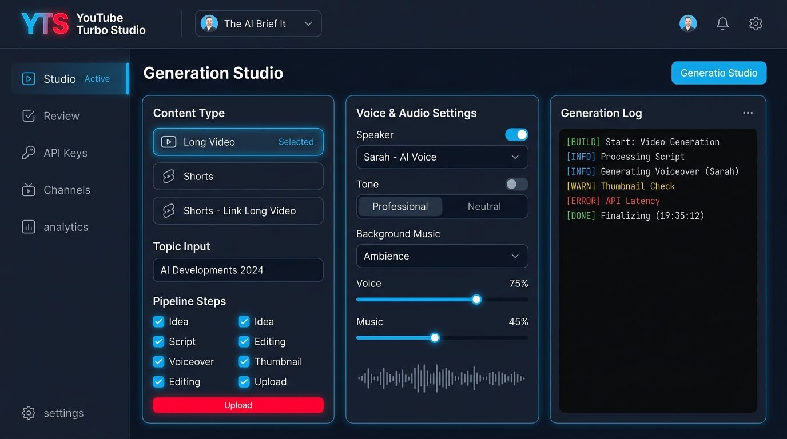
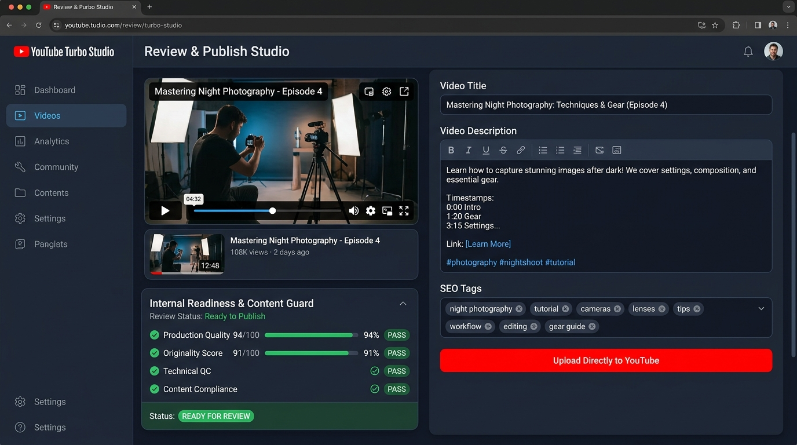
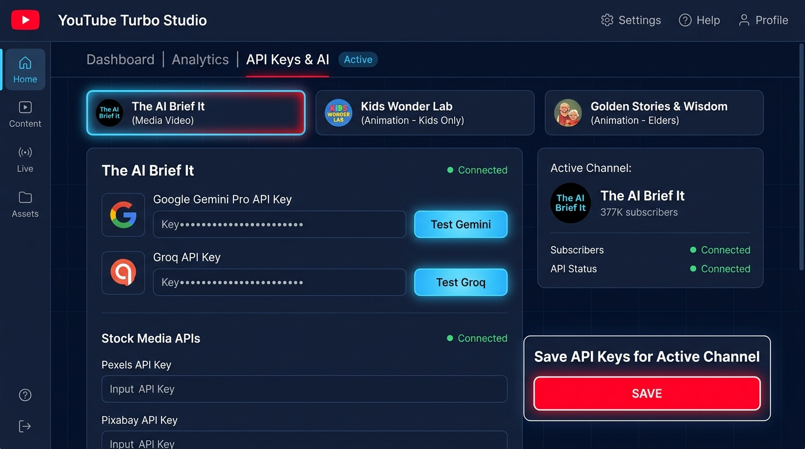
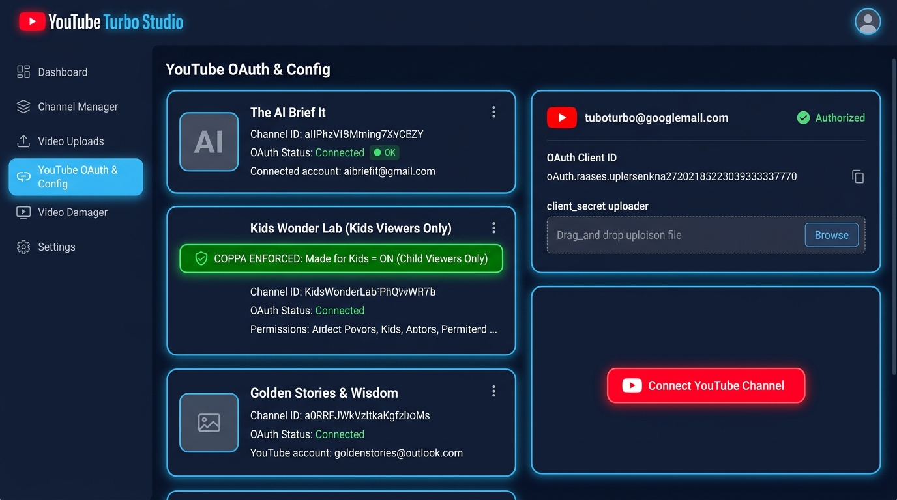

# 🎬 YouTube Turbo Studio

**An Autonomous Multi-Channel Agentic AI Video Studio & YouTube Publishing Engine.**

Combines the viral topic intelligence, hook tournaments, cinematic Ken Burns rendering, and automated YouTube OAuth workflows of **YouTube AI Agent Studio** with the versatile multi-LLM, multi-engine stock/animation capabilities of **MoneyPrinterTurbo**, powered by a **Sky Blue & YouTube Red Mix Theme**, dedicated **Multi-Channel Credentials Isolation**, and the **Section 3/4 Originality & Content Guard Gate**.



---

## 🌟 Key Highlights & Architecture

### ⚡ 1. Three Content Modes & Content Family Model
- **`Long Video` (16:9 Standard)**: Generates complete long-form explainer documentaries. Upon rendering, automatically registers into the channel's `content_history` as an eligible parent for derived Shorts.
- **`Shorts` (9:16 Standalone)**: Generates standalone vertical videos. Guarantees zero parent video requirement and never receives parent URLs or CTAs.
- **`Shorts - Link Long Video`**: Generates purpose-built Shorts derived from the strongest subtopics, moments, or lessons of an eligible Long video:
  - **Dynamic Lock State**: Automatically disabled with a protective badge (`🔒 Generate, import, or publish an eligible Long video first`) until an eligible Long video exists on the active channel.
  - **Channel Isolation**: Parent dropdown strictly filters to active-channel Long videos. Cross-channel linking (e.g. Kids Short linking to Science Long video) is rejected server-side.
  - **Lineage Tracking**: Stores `parent_content_id` and `content_family_id`.
  - **Dynamic Real URL Injection**: Injects the verified YouTube URL (`Watch the full video: https://youtube.com/watch?v=...`) into the Short description once the parent is published. **Never fabricates placeholder URLs** if the parent is not yet published.

---

### 🛡️ 2. Originality Engine & Hard Publishing Gate
Successful rendering does not automatically qualify a video for upload. Every generated video is evaluated against historical channel content to eliminate template repetition, spam, and content duplication.



- **Discrete Originality Score (0–100, Default Threshold: 85)**:
  - **Script Similarity**: N-gram shingle overlap against channel history.
  - **Concept Similarity**: Topic and keyword repetition detection.
  - **Hook Repetition**: Opening phrase and psychological angle diversity.
  - **Story Structure**: Plot beat pattern detection.
  - **Visual & Scene Reuse**: Detects excessive sequence duplication.
  - **Animation Action Reuse**: Checks for repeated character action chains.
  - **Metadata & Value-Add**: Validates informational and educational substance.
  - **Recurring Character Exception**: Allows recurring characters (e.g., *Toby the Tiger* or *Dr. Silas*) while penalizing identical story templates.
- **Separate Production Quality Score (Default Threshold: 90)**:
  - Distinct from originality, auditing audio quality, pacing, text legibility, and technical resolution.
- **Internal Readiness & Content Guard Panel**:
  - Live audit table in the Review Studio checking Production Quality, Originality, Technical QC, Content Compliance, Channel Validation, and Kids Safety.
  - Displays internal status: `READY FOR REVIEW` or `BLOCKED` *(includes explicit monetization disclaimer)*.
- **Targeted Stage Regeneration**:
  - Automatically isolates and re-runs only the failing component (hook, script rewrite, story structure, visual beats, audio narration, or subtitles) without rebuilding the entire pipeline from scratch.

---

### 🔑 3. Multi-Channel Individual API Keys & Credential Isolation



Each YouTube channel maintains its own isolated credentials, stored strictly in `channels/<channel_id>/.env`. No keys are shared or leaked between channels:

| Channel | Engine | Audience | Required Keys | Visual Source |
| :--- | :--- | :--- | :--- | :--- |
| **🎬 InsightSpark TV** | `media_video` | Curious Explorers (General Audience) | Gemini / Groq + Pexels + Pixabay | Pexels HD Videos & Photos (Ken Burns pan/zoom) |
| **🎨 Kids Wonder Lab** | `animation` | Children (Ages 3–6) · Kids Only | Gemini / Groq (+ optional ElevenLabs) | **Animation Engine** (Procedural & AI 2D Cartoon scenes) |
| **📖 Wonder Saga TV** | `animation` | Wonder Seekers (General Audience) | Gemini / Groq (+ optional ElevenLabs) | **Animation Engine** (Watercolor & Mythological Storybook plates) |

- **Strict Key Isolation**: If a channel does not have a key configured, its input remains empty. Saving keys for one channel never overwrites or affects another channel.
- **Dedicated Sub-Tabs**: The **API Keys & AI** tab provides 3 individual channel sub-tabs (`InsightSpark TV`, `Kids Wonder Lab`, `Wonder Saga TV`) with individual model dropdowns, test buttons, and save buttons.

---

### 📺 4. Multi-Channel YouTube OAuth & Kids COPPA Enforcement



- **Dedicated YouTube OAuth per Channel**:
  - Tokens are saved independently in `runtime/credentials/<channel_id>/youtube_token.pickle`.
  - Client secrets are isolated in `runtime/credentials/<channel_id>/client_secret.json`.
  - Connecting or refreshing YouTube authentication on one channel never affects another channel.
- **👶 Kids Viewers Only Functionality (COPPA Enforced)**:
  - For **Kids Wonder Lab**, all uploads automatically declare:
    ```json
    "status": {
      "selfDeclaredMadeForKids": true
    }
    ```
  - Directs videos exclusively to **YouTube Kids** and child viewer recommendations.
  - Automatically disables mini-player and comments in compliance with the Children's Online Privacy Protection Act (COPPA).
  - Pipeline prompts enforce preschool-safe educational themes (counting, colors, animals, kindness) with zero scary or mature content.
  - Content Guard enforces the hard **Kids Safety Gate** and **Educational Accuracy Gate** before any video can be published.

---

### 🎨 5. Animation Engine vs Media Video Engine
- **Why Normal and Animated Channels Use Different Visual Pipelines**:
  - Normal channels (*InsightSpark TV*) require realistic stock footage (space nebulae, physics laboratories, technology concepts) fetched via Pexels & Pixabay APIs.
  - Animated channels (*Kids Wonder Lab* and *Wonder Saga TV*) require vibrant cartoon characters, colorful rolling hills, rainbows, and warm storybook watercolor paintings. Real-world corporate stock footage is completely inappropriate for preschool or mythological storytelling.
- **Built-in Animation Engine (`video/animation_engine.py`)**:
  - Automatically activates when `engine: animation` is set in the channel profile.
  - Procedurally renders multi-layered 2D cartoon scenes (sky gradients, cartoon smiling suns, clouds, rainbow arcs, flower-dotted meadows) and storybook plates at 1080x1920 (Shorts) or 1920x1080 (Long).
  - **No Pexels or Pixabay API keys are required for animated channels.**

---

### 🍌 6. Nano Banana AI Generative Visuals
- **Official Generative Image Integration (`media/nano_banana_client.py`)**:
  - Direct REST integration supporting high-resolution text-to-image scene generation, multi-scene character continuity, and YouTube thumbnail generation.
  - **Supported Models**:
    - `nano-banana-flux`: Cinematic, photorealistic, high-detail visuals for documentaries and tech explainers.
    - `nano-banana-sdxl`: Ultra-fast high-resolution generation.
    - `nano-banana-cartoon-v1`: Bright, cheerful 2D cartoon characters and preschool illustrations for Kids Wonder Lab.
    - `nano-banana-storybook-v1`: Warm watercolor paintings and mythic storybook scenes for Wonder Saga TV.
  - Features real-time connection testing (`/api/settings/test-nano-banana`), base64 and URL image extraction, and automatic seamless fallback to stock video or procedural animation plates if an API key is unconfigured.

---

### 🎙️ 7. Multi-Provider Audio Generation & Multi-Character Voice Studio
- **Multi-Provider Speech Architecture (`audio/audio_service.py` & `audio/voice_profiles.py`)**:
  - Supports **Microsoft Edge-TTS** (free, ultra-realistic neural speech with millisecond boundary tracking).
  - Supports **ElevenLabs Prime Voice AI** (high fidelity, customizable voice clones and emotional delivery).
  - Supports **OpenAI TTS** (`tts-1` and `tts-1-hd` models with `alloy`, `echo`, `fable`, `onyx`, `nova`, and `shimmer` voices).
  - Supports **Google Cloud TTS / gTTS**.
- **Multi-Character Dialogue Generation (Kids Wonder Lab)**:
  - In preschool storytelling and animated dialogue, distinct voices are dynamically assigned to different characters:
    - **Story Narrator**: Gentle, cheerful teacher voice (`en-US-AnaNeural` or OpenAI `nova`).
    - **Character 1 (Pip the Bunny / Curious)**: Expressive, bubbly child voice (`en-US-AriaNeural` or OpenAI `fable`).
    - **Character 2 (Barnaby the Bear / Gentle Giant)**: Warm, friendly deep voice (`en-US-GuyNeural` or OpenAI `alloy`).
  - Automatically synthesizes individual dialogue lines, concatenates clips with natural 250ms conversational pauses, and generates unified, millisecond-accurate synchronized SRT subtitles!
- **Channel-Specific Voice Profiles**:
  - **InsightSpark TV**: Authoritative, cinematic, crisp cadence (`en-US-ChristopherNeural` or OpenAI `onyx`).
  - **Wonder Saga TV**: Dignified, unhurried, warm storytelling pacing (`en-GB-RyanNeural`, `en-US-GuyNeural`).

---

### 🛡️ 8. Centralized Multi-Provider Fallback Manager (`core/fallback_manager.py`)
Provides bulletproof zero-crash resilience across the entire content-generation pipeline:
- **Text / Scriptwriting**: Primary configured LLM (Google Gemini) ➔ Secondary LLM (Groq LLaMA) ➔ Tertiary LLM (OpenAI) ➔ Guaranteed structured safe script template.
- **Visuals / Media**: Nano Banana AI Generative Visuals ➔ Stock HD Video / Photos (Pexels / Pixabay) ➔ Procedural Cartoon & Storybook Animation Plates ➔ Programmatic Science Diagrams ➔ Cinematic Atmospheric Gradients.
- **Audio / Narration**: Configured Provider (ElevenLabs / OpenAI TTS) ➔ Guaranteed zero-cost Microsoft Edge-TTS.

---

## 💻 Installation & Setup

### Prerequisites
1. **Python 3.10 to 3.13** installed on your system.
2. **FFmpeg** installed and accessible in your system `PATH` (required for MoviePy rendering):
   - **Windows**: `winget install Gyan.FFmpeg` or download from [ffmpeg.org](https://ffmpeg.org).
   - **macOS**: `brew install ffmpeg`
   - **Linux**: `sudo apt install ffmpeg`
3. **Git** installed.

---

### Step 1: Clone the Repository
```bash
git clone https://github.com/hemanthkumar/YouTubeTurboStudio.git
cd YouTubeTurboStudio
```

---

### Step 2: Create and Activate a Virtual Environment
```powershell
# Windows (PowerShell)
python -m venv .venv
.\.venv\Scripts\Activate.ps1

# Windows (Command Prompt)
python -m venv .venv
.\.venv\Scripts\activate.bat

# macOS / Linux
python3 -m venv .venv
source .venv/bin/activate
```

---

### Step 3: Install Dependencies
```bash
pip install -r requirements.txt
```

> [!NOTE]
> All core dependencies (`Flask`, `moviepy`, `Pillow`, `google-api-python-client`, `google-auth-oauthlib`, `edge-tts`, `requests`, `python-dotenv`, `pyyaml`) are installed cleanly. A self-healing fallback is built in for PyYAML across both Python 3.12 and 3.13.

---

### Step 4: Run the Studio
```bash
python app.py
```
Open your browser and navigate to:
```
http://localhost:5000
```

---

## 🕹️ Step-by-Step Usage Guide

### 1. Configure Channel API Keys
1. Open the **API Keys & AI** tab.
2. Click on the channel you wish to configure:
   - **InsightSpark TV**: Enter Gemini API key or Groq API key, along with Pexels and Pixabay keys. Click **Save API Keys for InsightSpark TV**.
   - **Kids Wonder Lab**: Enter Gemini or Groq key. Notice stock footage keys are not needed! Click **Save API Keys for Kids Wonder Lab**.
   - **Wonder Saga TV**: Enter Gemini or Groq key. Click **Save API Keys for Wonder Saga TV**.
3. Use the **Test Key** buttons to verify your credentials instantly.

### 2. Connect YouTube Channels
1. Open the **YouTube OAuth & Config** tab.
2. Select your channel sub-tab:
   - Upload your `client_secret.json` or enter its local path and click **Load**.
   - Click **Connect YouTube Channel** to authorize via Google OAuth in your browser.
   - For **Kids Wonder Lab**, notice the **COPPA Enforced: Made for Kids = ON** badge confirming that uploads are directed strictly to child viewers.

### 3. Generate Videos
1. Select your target channel from the prominent dropdown in the top header.
2. Choose your **Content Mode**:
   - `Long Video (16:9)`
   - `Shorts (9:16 Standalone)`
   - `Shorts - Link Long Video` *(automatically enabled once an eligible Long video exists on this channel)*.
3. Enter an optional topic (e.g. *"Why is the sky blue?"* for Kids, or leave empty for AI viral research).
4. Click **▶ Start Video Pipeline**.
5. Watch live progress through the real-time stage tracker card and live studio console.

### 4. Review & Publish
1. Open the **Review & Publish** tab.
2. Check the **Internal Readiness Panel**:
   - Verify that **Production Quality**, **Originality**, **Technical QC**, **Content Compliance**, and **Kids Safety** pass.
   - If a gate fails, click the corresponding **Targeted Regenerate** button (e.g. *Regenerate Hook* or *Rewrite Script*) to repair only the failing element.
3. Preview the rendered MP4 video, narration audio, and custom thumbnail.
4. Click **🚀 Publish to YouTube** to upload with resumable chunking and channel isolation.

---

## 🧪 Test Suite

Run the full automated test suite (all tests mock external network and YouTube uploads):
```bash
# Run all tests
python -m unittest discover -s tests -p "test_*.py"

# Run Multi-Channel Isolation & Animation Engine tests
python -m unittest tests/test_multi_channel_isolation.py

# Run Content Guard & Addendum Acceptance tests
python -m unittest tests/test_content_guard.py
```

---

## 📄 License
MIT License. Built for autonomous YouTube creators, educators, and storytellers.
